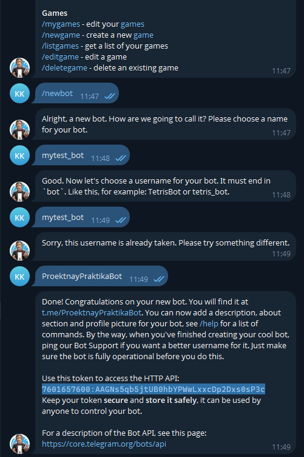
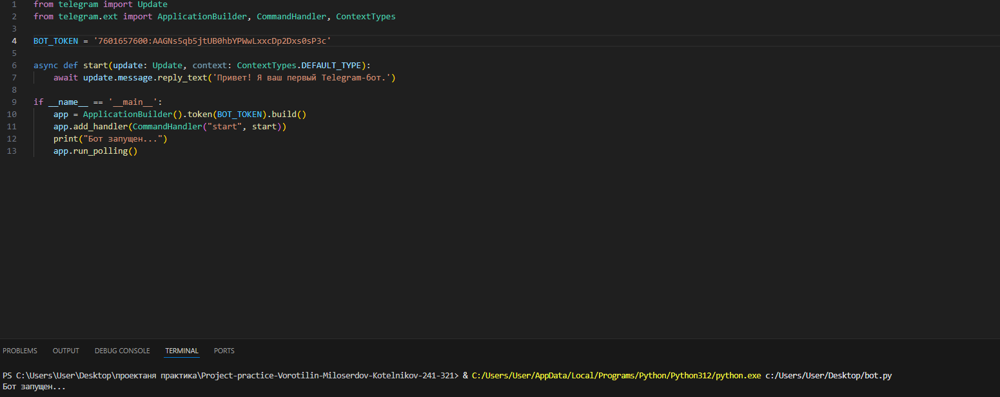
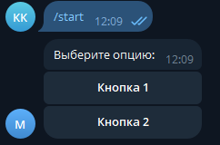

# 📚 Создание Telegram-бота на Python с нуля

## Исследование предметной области

### Что такое Telegram-бот?

Telegram-бот — это программируемый аккаунт в Telegram, который взаимодействует с пользователями через API Telegram. Он может автоматически обрабатывать команды, отвечать на сообщения, выполнять задачи и интегрироваться с другими сервисами.

### Основные компоненты:

- **BotFather** — официальный бот Telegram для создания новых ботов.
- **Telegram Bot API** — интерфейс для связи с серверами Telegram.
- **Python** — удобный язык программирования для начинающих.
- **Библиотека `python-telegram-bot`** — популярная библиотека для Python, упрощающая работу с Telegram Bot API.

---

## 🔧 Пошаговое руководство по созданию Telegram-бота

### Шаг 1: Получение токена через BotFather

1. Откройте Telegram и найдите пользователя `@BotFather`.
2. Введите команду `/newbot`.
3. Укажите имя бота (например, `My Test Bot`).
4. Укажите username бота (должен оканчиваться на `bot`, например, `mytest_bot`).
5. Скопируйте токен, который вы получите (он нужен для доступа к API).

📷 

---

### Шаг 2: Установка Python и библиотеки

Убедитесь, что у вас установлен Python 3. Затем выполните:

```bash
pip install python-telegram-bot --upgrade
```

---

### Шаг 3: Написание кода для бота

Создайте файл `bot.py` и вставьте следующий код:

```python
from telegram import Update
from telegram.ext import ApplicationBuilder, CommandHandler, ContextTypes

BOT_TOKEN = 'YOUR_TOKEN_HERE'  # Замените на ваш токен

async def start(update: Update, context: ContextTypes.DEFAULT_TYPE):
    await update.message.reply_text('Привет! Я ваш первый Telegram-бот.')

if __name__ == '__main__':
    app = ApplicationBuilder().token(BOT_TOKEN).build()
    app.add_handler(CommandHandler("start", start))
    print("Бот запущен...")
    app.run_polling()
```

---

### Шаг 4: Запуск бота

Выполните:

```bash
python bot.py
```

Теперь бот работает и может принимать команды.

📷 

---

### Шаг 5: Обработка сообщений

Добавьте функцию-эхо:

```python
from telegram.ext import MessageHandler, filters

async def echo(update: Update, context: ContextTypes.DEFAULT_TYPE):
    await update.message.reply_text(f"Вы сказали: {update.message.text}")

app.add_handler(MessageHandler(filters.TEXT & ~filters.COMMAND, echo))
```

---

### Шаг 6: Добавление кнопок

```python
from telegram import InlineKeyboardButton, InlineKeyboardMarkup
from telegram.ext import CallbackQueryHandler

async def start(update: Update, context: ContextTypes.DEFAULT_TYPE):
    keyboard = [
        [InlineKeyboardButton("Кнопка 1", callback_data='1')],
        [InlineKeyboardButton("Кнопка 2", callback_data='2')],
    ]
    reply_markup = InlineKeyboardMarkup(keyboard)
    await update.message.reply_text('Выберите опцию:', reply_markup=reply_markup)

async def button(update: Update, context: ContextTypes.DEFAULT_TYPE):
    query = update.callback_query
    await query.answer()
    await query.edit_message_text(text=f"Вы выбрали: {query.data}")

app.add_handler(CallbackQueryHandler(button))
```

📷 

---

## 📊 Схема работы Telegram-бота

📷 

1. Пользователь отправляет сообщение боту.
2. Telegram перенаправляет его на сервер.
3. Сервер обрабатывает сообщение и возвращает ответ.

---

## 🧪 Практика

1. Откройте Telegram, найдите своего бота.
2. Отправьте `/start` — получите приветствие.
3. Отправьте текст — получите ответ-эхо.
4. Нажмите на кнопку — получите результат выбора.

---

## 📘 Заключение

Вы узнали, как создать Telegram-бота с нуля на Python:

- Получили токен через BotFather.
- Установили библиотеку.
- Написали код, добавили команды и кнопки.
- Запустили бота и протестировали его.
