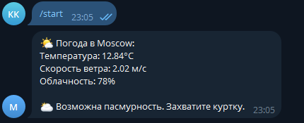
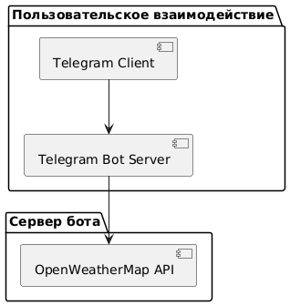

# 📘 Техническая документация: Модифицированный Telegram-бот с погодным функционалом

## 🧩 Цель модификации

Добавлена функция получения текущей погоды. При вводе команды `/start` пользователю предлагается кнопка **"Узнать погоду"**. После нажатия бот:

- Запрашивает погоду через OpenWeatherMap API;
- Отправляет пользователю информацию: температура, ветер, облачность;
- Формирует персонализированное сообщение в зависимости от условий (дождь, солнце, облачность и т.д.).

---

## 🛠️ Используемые технологии

| Компонент            | Описание                            |
|----------------------|-------------------------------------|
| Язык программирования| Python 3.12                         |
| Telegram Bot API     | библиотека `python-telegram-bot`   |
| Погодный API         | OpenWeatherMap (https://openweathermap.org/api) |
| Протоколы            | HTTP/HTTPS                          |

---

## 📥 Установка зависимостей

```bash
pip install python-telegram-bot requests
```

---


## 🧑‍💻 Исходный код: weather_bot.py
```python

import requests
from telegram import Update, InlineKeyboardButton, InlineKeyboardMarkup
from telegram.ext import (
    ApplicationBuilder,
    CommandHandler,
    CallbackQueryHandler,
    ContextTypes
)

BOT_TOKEN = 'ВАШ_ТОКЕН'
WEATHER_API_KEY = 'ВАШ_API_КЛЮЧ'
CITY = 'Moscow'
WEATHER_URL = f'https://api.openweathermap.org/data/2.5/weather?q={CITY}&appid={WEATHER_API_KEY}&units=metric&lang=ru'

# Команда /start
async def start(update: Update, context: ContextTypes.DEFAULT_TYPE):
    keyboard = [[InlineKeyboardButton("Узнать погоду", callback_data='weather')]]
    reply_markup = InlineKeyboardMarkup(keyboard)
    await update.message.reply_text('Привет! Что вы хотите сделать?', reply_markup=reply_markup)

# Обработка кнопки "Узнать погоду"
async def button(update: Update, context: ContextTypes.DEFAULT_TYPE):
    query = update.callback_query
    await query.answer()

    if query.data == 'weather':
        weather_info = get_weather()

        message = f"""🌤️ Погода в {CITY}:
Температура: {weather_info['temp']}°C
Скорость ветра: {weather_info['wind']} м/с
Облачность: {weather_info['clouds']}%
"""

        condition = weather_info["description"].lower()
        if "дожд" in condition:
            message += "\n☔ Сегодня дождливо. Возьмите зонт!"
        elif "ясно" in condition:
            message += "\n☀ Отличная солнечная погода. Не забудьте очки!"
        elif "облачно" in condition:
            message += "\n🌥 Возможна пасмурность. Захватите куртку."

        await query.edit_message_text(message)

def get_weather():
    try:
        response = requests.get(WEATHER_URL)
        data = response.json()
        return {
            "temp": data["main"]["temp"],
            "wind": data["wind"]["speed"],
            "clouds": data["clouds"]["all"],
            "description": data["weather"][0]["description"]
        }
    except Exception:
        return {
            "temp": "н/д",
            "wind": "н/д",
            "clouds": "н/д",
            "description": "Ошибка получения данных"
        }

# Запуск приложения
if __name__ == "__main__":
    app = ApplicationBuilder().token(BOT_TOKEN).build()
    app.add_handler(CommandHandler("start", start))
    app.add_handler(CallbackQueryHandler(button))
    print("Бот запущен...")
    app.run_polling()
```

## ☁️ Как работает кнопка "Узнать погоду"

После запуска бота пользователем (ввод команды `/start`), бот отправляет сообщение с интерактивной кнопкой **"Узнать погоду"**. Этот функционал реализован с помощью `InlineKeyboardMarkup`, что позволяет пользователю взаимодействовать с ботом без необходимости ввода команд вручную.

### 🔄 Последовательность работы:

1. **Пользователь запускает бота командой `/start`**  
   Бот отвечает сообщением с кнопкой **"Узнать погоду"**.

2. **Пользователь нажимает кнопку**  
   Бот обрабатывает нажатие с помощью `CallbackQueryHandler`.

3. **Бот обращается к внешнему API OpenWeatherMap**  
   Отправляется HTTP-запрос на получение текущей погоды по заранее заданному городу (например, `Moscow`).

4. **Бот получает JSON-ответ от API**, из которого извлекается:
   - температура воздуха,
   - скорость ветра,
   - уровень облачности,
   - текстовое описание погодных условий.

5. **Формируется адаптированное сообщение**  
   В зависимости от погодных условий добавляется персонализированный текст:
   - При дожде: `☔ Сегодня дождливо. Возьмите зонт!`
   - При ясной погоде: `☀ Отличная солнечная погода. Не забудьте очки!`
   - При облачности: `🌥 Возможна пасмурность. Захватите куртку.`

6. **Бот отправляет это сообщение пользователю**  
   Используется метод `edit_message_text`, чтобы заменить исходное сообщение с кнопкой на текст с погодой.

## 📊 Пример вывода



## 📐 UML Диаграммы



## 📌 Диаграмма последовательностей


---