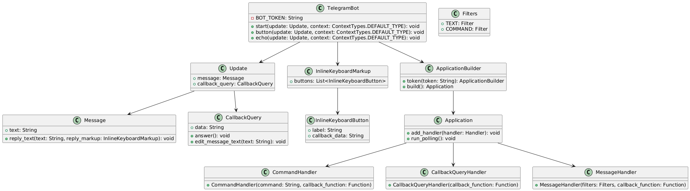
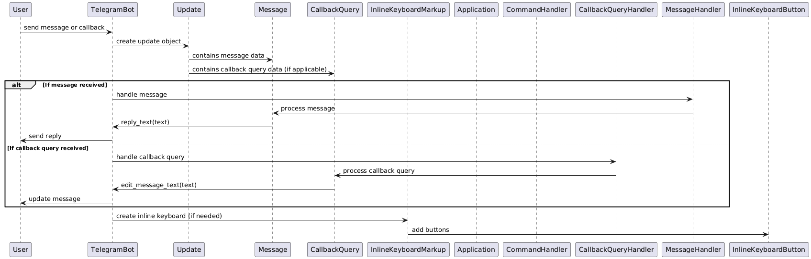
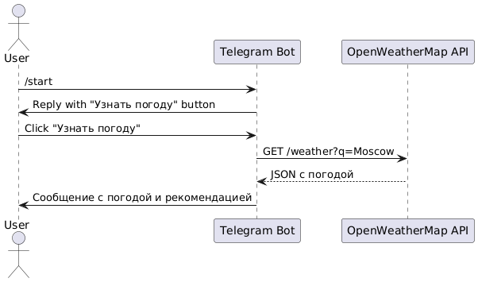

# 📌 Финальный отчёт по проекту: Telegram-бот на Python с погодным функционалом

## 🧠 Описание проекта

**Название проекта:** Telegram-бот с погодной функцией  
**Выбранная тема:** Telegram-бот на языке Python  
**Команда:**  
- Милосердов Николай  
- Котельнов Даниил  
- Воротилин Илья  

**Краткое описание:**  
Разработан Telegram-бот на Python с использованием библиотеки `python-telegram-bot`. Основной функционал — взаимодействие с пользователем через команды и кнопки, предоставление прогноза погоды через API OpenWeatherMap.

---

## 🗂 Хронология выполнения проекта

| Этап | Описание | Ответственный |
|------|----------|----------------|
| 1. Исследование предметной области | Изучены основы Telegram Bot API, работа BotFather, библиотека `python-telegram-bot` | Николай |
| 2. Создание базового бота | Реализованы обработка команды `/start`, inline-кнопки, echo-функция | Илья |
| 3. Документация и руководство | Составлены поэтапные инструкции, сделаны диаграммы, описана архитектура | Николай |
| 4. Модификация | Добавлен функционал прогноза погоды, интеграция с OpenWeatherMap API | Николай |
| 5. Поддержка участников | Помощь Даниилу с установкой среды, разбор ошибок | Николай, Илья |
| 6. Подготовка презентации и финального отчёта | Обобщение информации, оформление проекта | Николай |

---

## 👥 Индивидуальные планы и вклад участников

### 🎓 Милосердов Николай (ведущий разработчик)
- Инициировал выбор темы и стека.
- Провёл исследование предметной области.
- Реализовал основную архитектуру бота.
- Добавил функциональность прогноза погоды.
- Создал инструкции, руководства, диаграммы, презентацию и финальный отчёт.

### 🧩 Котельнов Даниил
- Ознакомился с основами работы Telegram-ботов.
- Тестировал базовые функции бота (обработка команд и кнопок).
- Работал под руководством команды над доработкой и пониманием кода.
- Принимал участие в итоговой проверке работоспособности.

### 💡 Воротилин Илья
- Реализовал базовую обработку сообщений и команд.
- Участвовал в тестировании логики обработки кнопок.
- Помогал с написанием пользовательских сообщений и адаптацией интерфейса.

---

## 🔨 Используемые технологии

| Компонент | Описание |
|-----------|----------|
| ЯП | Python 3.12 |
| Telegram API | `python-telegram-bot v20+` |
| Среда разработки | VSCode, PyCharm |
| Внешний API | OpenWeatherMap |
| Протокол | HTTPS (REST) |

---

## 📊 Визуализация архитектуры и процессов

### 📐 Диаграмма компонентов



### 🔄 Диаграмма последовательности (основной бот)



### ☁️ Диаграмма последовательности (модификация — погода)



---

## 🧪 Краткое описание реализации

1. **Создание бота через BotFather**  
   Получение токена, настройка имени и username.

2. **Разработка кода бота**  
   Использованы обработчики команд, сообщений и кнопок.

3. **Добавление кнопки "Узнать погоду"**  
   Запрос к API OpenWeatherMap, отображение результата пользователю.

4. **Обработка ошибок и UX**  
   Добавлены персонализированные сообщения (например: «☔ Возьмите зонт»).

---

## 🛠️ Фрагмент кода: получение погоды

```python
def get_weather():
    response = requests.get(WEATHER_URL)
    data = response.json()
    return {
        "temp": data["main"]["temp"],
        "wind": data["wind"]["speed"],
        "clouds": data["clouds"]["all"],
        "description": data["weather"][0]["description"]
    }
```

## 🔧 Модификация проекта

### Что было добавлено:
- Интеграция с внешним погодным API — **OpenWeatherMap**  
- Добавлена кнопка **"Узнать погоду"** в стартовом меню  
- Реализована логика формирования ответов на основе погодных условий:
  - ☀ **Ясно** — совет взять очки  
  - ☔ **Дождь** — напоминание о зонте  
  - 🌥 **Облачно** — предложение надеть куртку  

**Цель:**  
Повысить прикладную ценность и функциональность Telegram-бота, расширить практические навыки работы с API и взаимодействия с внешними сервисами в рамках Python-проекта.

---

## 🎥 Видео-презентация проекта

В рамках видео-презентации были раскрыты следующие пункты:

- **Цель и задачи проекта**: создание Telegram-бота, реагирующего на команды и предоставляющего информацию о погоде.  
- **Выбор технологий**: Python, библиотека `python-telegram-bot`, API OpenWeatherMap.  
- **Процесс разработки**: пошаговая демонстрация создания бота, получения токена, добавления кнопок и написания функций.  
- **Работа модификации**: пример нажатия кнопки и получения прогноза.  
- **Вывод**: бот успешно выполняет поставленные задачи и демонстрирует устойчивую работу.

📌 *Видео прилагается к проекту в отдельном файле и размещается в Git-репозитории.*

---

## 📘 Заключение

В ходе выполнения проекта команда:

- Освоила основы работы с **Telegram Bot API** и библиотекой `python-telegram-bot`.
- Получила опыт взаимодействия с внешним REST API (**OpenWeatherMap**).
- Разработала функционального Telegram-бота с кнопками, командами и адаптивными ответами.
- Провела модификацию базовой версии, добавив погодную функциональность.
- Подготовила техническую документацию, UML-диаграммы и финальный отчёт.

**Проект можно использовать как основу для более сложных решений**: добавление геолокации, базы данных, авторизации пользователей, рассылок и многого другого.
