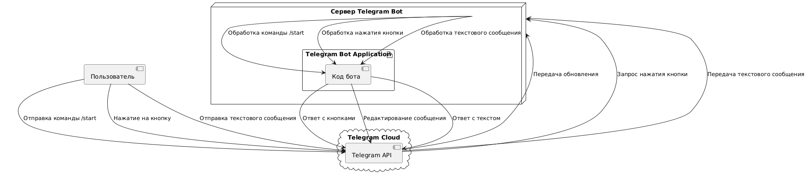

# 📘 Руководство: Создание Telegram-бота на Python

## 📌 Описание проекта

**Цель:** разработать Telegram-бота с базовым функционалом:
- Ответ на команду `/start`
- Вывод inline-кнопок
- Ответ на текстовые сообщения
- Обработка событий нажатия кнопок

**Технологии:**
- Язык программирования: `Python 3.12+`
- Библиотека: `python-telegram-bot v20+`
- Среда разработки: `VSCode`, `PyCharm` или любой редактор

---

## 📁 Структура проекта

```bash
telegram-bot/
│
├── bot.py                 # Главный файл бота
├── requirements.txt       # Зависимости проекта
├── README.md              # Описание проекта
└── diagrams/              # Диаграммы и схемы
```

---

## 🛠️ Установка

1. Установите Python:
https://www.python.org/downloads/

2. Создайте виртуальное окружение:

```bash
python -m venv venv
source venv/bin/activate    # Linux/macOS
venv\Scripts\activate     # Windows
```

3. Установите зависимости:

```bash
pip install python-telegram-bot
```

4. Создайте файл `bot.py`

---

## 🧠 Архитектура бота

### 🧩 Компоненты

- `ApplicationBuilder` — запуск и конфигурация бота
- `CommandHandler` — обработка команд `/start`
- `CallbackQueryHandler` — работа с inline-кнопками
- `MessageHandler` — ответы на текстовые сообщения

---

### 📊 UML Диаграмма компонентов (Component Diagram)


---

## 💻 Основной код бота

```python
from telegram import Update, InlineKeyboardButton, InlineKeyboardMarkup
from telegram.ext import (
    ApplicationBuilder, CommandHandler, CallbackQueryHandler,
    MessageHandler, ContextTypes, filters
)

BOT_TOKEN = 'ВАШ_ТОКЕН_ЗДЕСЬ'

async def start(update: Update, context: ContextTypes.DEFAULT_TYPE):
    keyboard = [
        [InlineKeyboardButton("Кнопка 1", callback_data='1')],
        [InlineKeyboardButton("Кнопка 2", callback_data='2')],
    ]
    reply_markup = InlineKeyboardMarkup(keyboard)
    await update.message.reply_text('Выберите опцию:', reply_markup=reply_markup)

async def button(update: Update, context: ContextTypes.DEFAULT_TYPE):
    query = update.callback_query
    await query.answer()
    await query.edit_message_text(text=f"Вы выбрали: {query.data}")

async def echo(update: Update, context: ContextTypes.DEFAULT_TYPE):
    await update.message.reply_text(f"Вы сказали: {update.message.text}")

if __name__ == '__main__':
    app = ApplicationBuilder().token(BOT_TOKEN).build()
    app.add_handler(CommandHandler("start", start))
    app.add_handler(CallbackQueryHandler(button))
    app.add_handler(MessageHandler(filters.TEXT & ~filters.COMMAND, echo))
    print("Бот запущен...")
    app.run_polling()
```

---

## ⚙️ Последовательность обработки команд

### 📈 Диаграмма последовательности (Sequence Diagram)


---

## 🔄 Логика обработки

| Событие                     | Обработчик             | Результат |
|----------------------------|------------------------|-----------|
| `/start`                   | `CommandHandler`       | Появляется меню с кнопками |
| Нажатие на кнопку          | `CallbackQueryHandler` | Бот отвечает: "Вы выбрали: X" |
| Любой текст (без /)        | `MessageHandler`       | Ответ: "Вы сказали: ..." |

---

## 🌐 Диаграмма развёртывания (Deployment Diagram)



---

## 🧪 Тестирование

1. ✅ Отправьте `/start` — должна появиться клавиатура.
2. ✅ Нажмите кнопку — бот ответит "Вы выбрали: 1/2".
3. ✅ Отправьте любое сообщение — бот повторит его.

---

## 📂 requirements.txt

```txt
python-telegram-bot>=20.0
```

Установите зависимости:

```bash
pip install -r requirements.txt
```

---

## 📌 Рекомендации

- Всегда проверяйте токен через `getMe` метод API
- Добавьте обработку ошибок
- Логируйте действия (`logging`)

---

## 🧱 Расширение проекта

| Функция               | Модуль / Подход                         |
|----------------------|------------------------------------------|
| Кнопки с URL         | `InlineKeyboardButton(url=...)`          |
| Меню команд          | `set_my_commands()`                      |
| Интеграция с БД      | `sqlite3`, `SQLAlchemy`, `PostgreSQL`    |
| Подключение вебхука  | `webhook` вместо `polling`               |
