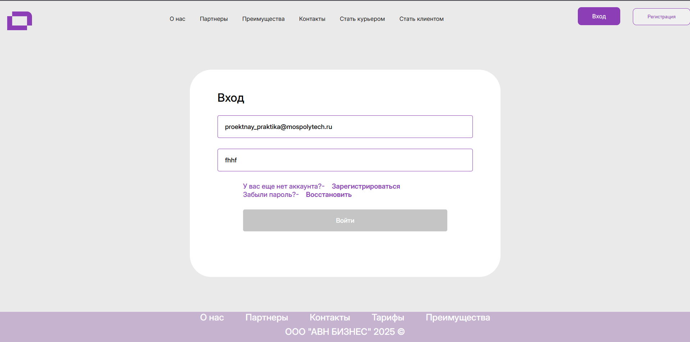

# Журнал прогресса

## Новое направление в дизайне проекта
🔹 **Дата:** 28 февраля 2025  
🔹 **Тема:** Назначение нового руководителя отдела дизайна и разработка UI Kit

С 28 февраля в нашей команде произошли важные изменения — **Воротилин Илья** назначен новым руководителем отдела дизайна. С первых дней своей работы Илья инициировал процессы по унификации визуального стиля проекта.

В течение одной недели им был разработан **UI Kit** — набор готовых интерфейсных компонентов, который позволяет команде оперативно и последовательно решать задачи в области дизайна. Благодаря этому решению мы обеспечили:

- единообразие всех пользовательских интерфейсов,
- сокращение времени на разработку новых элементов,
- повышение качества визуальной части продукта.

Формирование единого стиля стало важным шагом к улучшению взаимодействия внутри команды и усилению внешнего имиджа проекта. Работа по внедрению UI Kit продолжается.

---

## Завершение верстки главной страницы  
🔹 **Дата:** 11 марта 2025  
🔹 **Тема:** Готовность основной пользовательской страницы

11 марта **Котельников Даниил** завершил работу над вёрсткой главной страницы веб-приложения. Данный элемент является ключевым с точки зрения пользовательского взаимодействия, поскольку именно главная страница служит точкой входа и навигационным узлом ко всем основным разделам сайта.

Создание главной страницы стало одной из приоритетных задач фронтенд-направления, поскольку от её структуры, визуальной читаемости и функциональности зависит первое впечатление пользователя и эффективность работы с интерфейсом в целом.

На текущем этапе реализована:

- структура главных разделов сайта,
- базовая адаптивность под различные устройства,
- интеграция элементов общего дизайна, согласно UI Kit.

Дальнейшая работа будет направлена на доработку интерактивных компонентов и подключение к серверной логике.

---

## Интеграция фронтенда и начало соединения с API  
🔹 **Дата:** 4 апреля 2025  
🔹 **Тема:** Объединение фронтенд-частей и старт интеграции с серверной логикой

4 апреля **Милосердов Николай** успешно объединил все наработки по фронтенд-части проекта в единую систему. Этот шаг стал важным этапом в развитии проекта, поскольку позволил приступить к интеграции клиентского интерфейса с API.

Начало процесса интеграции означает, что фронтенд теперь начинает взаимодействовать с реальными данными и бизнес-логикой, а сам проект впервые начинает приобретать целостный и функциональный вид. Это значительно повышает уровень зрелости системы и открывает возможности для полноценного тестирования пользовательских сценариев.

Работа в этом направлении продолжается. Ожидается, что в ближайшие недели будет реализована основная часть функционального взаимодействия между интерфейсом и серверной частью.

|
