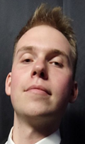

# О проекте «АСАДа»

## В чем заключается идея нашего проекта?

Современные курьерские службы сталкиваются с необходимостью повышения эффективности, сокращения времени доставки и минимизации затрат. В условиях жесткой конкуренции и растущего спроса традиционные методы управления доставкой становятся невыгодными, особенно для организаций, работающих с государственной тайной и требующих особых условий транспортировки. В связи с этим возникает необходимость в разработке эффективной автоматизированной системы для управления процессами доставки в компании-заказчике, которая сможет оптимизировать все этапы логистики и обеспечить надежность и безопасность перевозок.

## Команда АСАДа

В проекте участвуют **50 студентов**, объединённых общей целью и стремлением к высоким результатам. Каждый вносит свой вклад, применяя знания, технические навыки и инициативу. Мы активно взаимодействуем, обмениваемся идеями и поддерживаем друг друга на всех этапах работы.

На учебных занятиях мы анализируем ход проекта и обсуждаем возможные улучшения. Команда работает **ответственно и слаженно**, что позволяет уверенно продвигаться к завершению проекта.

## Задачи проекта

| **Задача 1** | **Задача 2** | **Задача 3** | **Задача 4** |
|------------------------|---------------------------|--------------------|----------------------------|
| Создание нового концепта, влияющего на привлечение будущих клиентов. | Создание индивидуальной среды для пользования веб-платформы клиентами, удовлетворенности в предоставленных услугах. | Разработка надежной бизнес-логики, отражающей текущие процессы и потребности компании, обеспечивающей стабильность и эффективность. | Внедрение системы в бизнес-процессы ООО «ABH Бизнес» с минимизацией рисков. |

## Руководство

Руководящая команда проекта состоит из шести ключевых участников, каждый из которых вносит значительный вклад в успешную реализацию задачи. Во главе стоит руководитель проекта Ярослав Владимирович Никулин, обладающий богатым опытом в бизнесе и преподавательской деятельности. Координацию работы и мотивацию команды обеспечивает тимлид **Артём Чистяков**, который отвечает за организацию процесса и взаимодействие с заказчиками.

Техническую часть проекта возглавляют два руководителя направлений разработки: Илья Андреевич Тамьяров, ответственный за фронтенд, и Алексей Игоревич Степаненко, курирующий бэкенд. Медиа-направление возглавляет Екатерина Георгиевна Субботкина, которая отвечает за создание контента и коммуникацию внутри команды. Направление дизайна курирует **Илья Воротилин**, контролирующий визуальную составляющую проекта и работу дизайнеров.

Все руководители проявляют высокий профессионализм, ответственность и поддерживают командный дух, способствуя эффективной и слаженной работе над проектом.

---

## Фотографии руководителей

| {width=120px} | {width=120px} | {width=120px} | {width=120px} | {width=120px} | {width=120px} |
|:--------------------------------------------------------------------:|:------------------------------------------------------------:|:------------------------------------------------------------------:|:--------------------------------------------------------------------------:|:-------------------------------------------------------------------------:|:-------------------------------------------------------------:|

